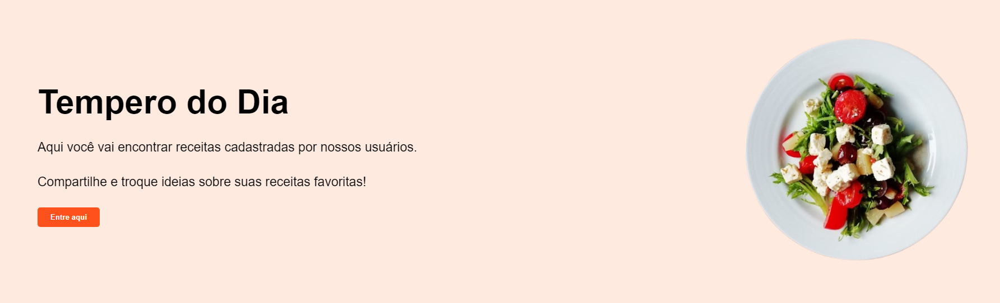

# Tempero do dia - Rede social

Olá, sejam bem vindos à rede social Tempero do dia!!
desenvolvida e pensada com o objetivo de facilitar e tornar mais divertido compartilhar as receitas com outras pessoas!!

## Tecnologias usadas

- JavaScript
- Html/Css
- PostgreeSQL

## Telas

Index: Na tela index, temos a apresentação inicial da nossa rede social, com alguns cards de receitas populares que foram publicadas por usuarios da rede.
Receitas: Temos a receita mais popular.
Perfil: É aqui que você vai encontrar as suas receitas e comentários de outros usuários em relação a receitas que você publicou, além de nela, você conseguir gerar novas publicações(feature ainda não implementada).
Pesquisa: Nessa pagina você encontra a receita que você quer aprender a fazer!!

## Como usar

1. Acesse a página através do link: .
2. Consulte a receita desejada.
3. Comente e crie discussões sobre a receita.
4. Pesquise sobre as receitas.
5. Crie Posts sobre as receitas.

## Demostração do Site

# Criadores

Ana Duarte - 

David Mizrahy -

Eduardo Carvalho - 

Nataly Rodrigues - 

